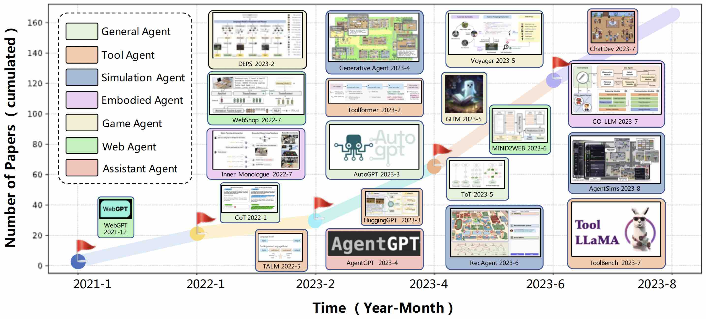
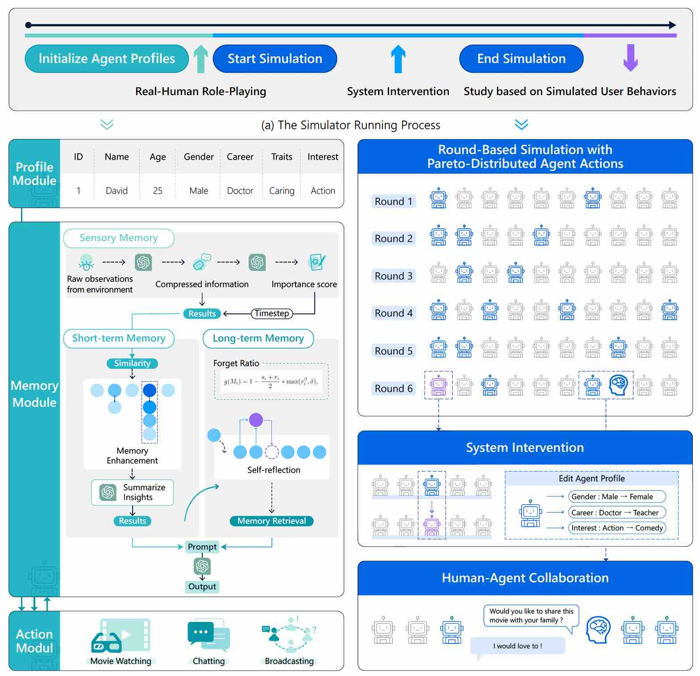
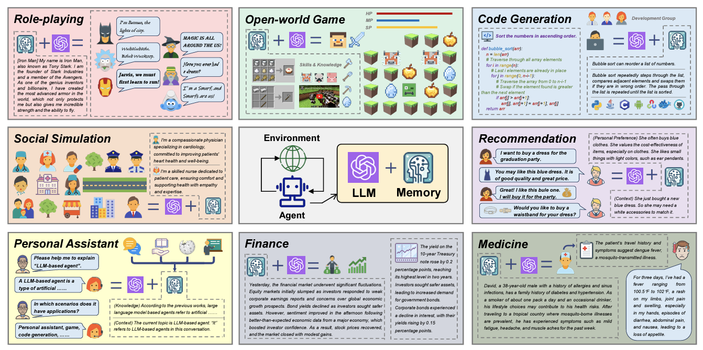
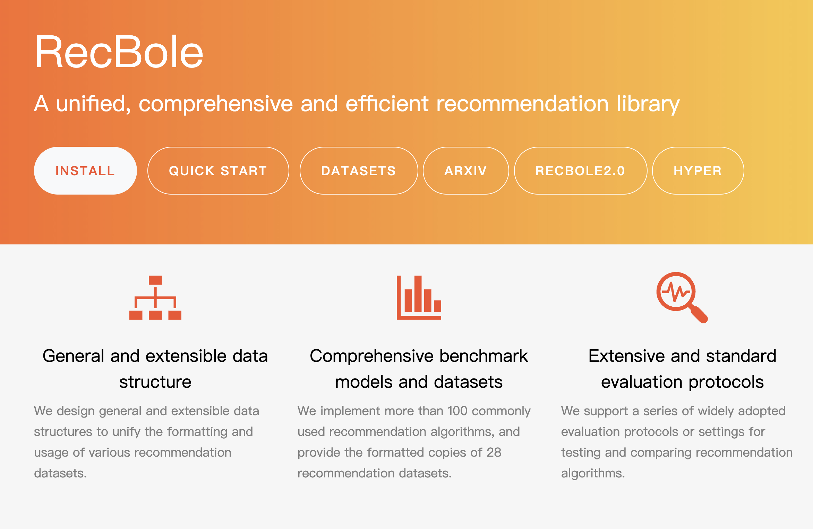
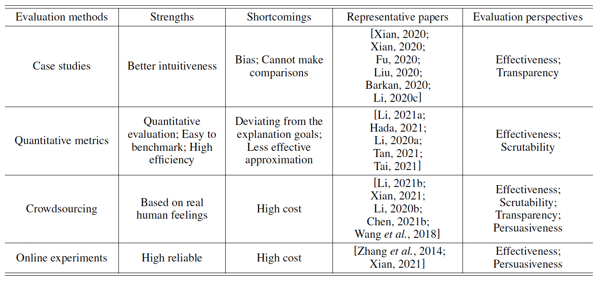
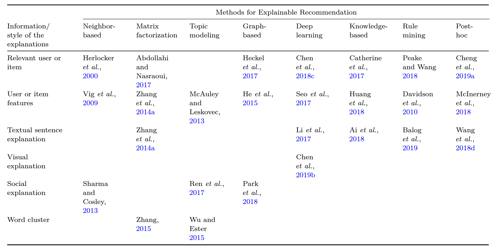

<!-- 

 

<b>A Survey on Large Language Model based Autonomous Agents</b> 
Lei Wang, Chen Ma, Xueyang Feng, Zeyu Zhang, Hao Yang, Jingsen Zhang, Zhiyuan Chen, Jiakai Tang, <b>Xu Chen</b>, Yankai Lin, Wayne Xin Zhao, Zhewei Wei, Ji-Rong Wen. 

Autonomous agents have long been a prominent research topic in the academic community. Previous research in this field often focuses on training agents with limited knowledge within isolated environments, which diverges significantly from the human learning processes, and thus makes the agents hard to achieve human-like decisions. Recently, through the acquisition of vast amounts of web knowledge, large language models (LLMs) have demonstrated remarkable potential in achieving human-level intelligence. This has sparked an upsurge in studies investigating autonomous agents based on LLMs. To harness the full potential of LLMs, researchers have devised diverse agent architectures tailored to different applications. In this paper, we present a comprehensive survey of these studies, delivering a systematic review of the field of autonomous agents from a holistic perspective. More specifically, our focus lies in the construction of LLM-based agents, for which we propose a unified framework that encompasses a majority of the previous work. Additionally, we provide a summary of the various applications of LLM-based AI agents in the domains of social science, natural science, and engineering. Lastly, we discuss the commonly employed evaluation strategies for LLM-based AI agents. Based on the previous studies, we also present several challenges and future directions in this field. 
 
https://arxiv.org/abs/2308.11432 
Frontiers of Computer Science (<b>FCS 2024</b>) 
https://github.com/Paitesanshi/LLM-Agent-Survey

 

<b>User Behavior Simulation with Large Language Model based Agents</b> 
Lei Wang, Jingsen Zhang, Hao Yang, Zhiyuan Chen, Jiakai Tang, Zeyu Zhang, <b>Xu Chen</b>, Yankai Lin, Ruihua Song, Wayne Xin Zhao, Jun Xu, Zhicheng Dou, Jun Wang, Ji-Rong Wen. 

Simulating high quality user behavior data has always been a fundamental problem in human-centered applications, where the major difficulty originates from the intricate mechanism of human decision process. Recently, substantial evidences have suggested that by learning huge amounts of web knowledge, large language models (LLMs) can achieve human-like intelligence. We believe these models can provide significant opportunities to more believable user behavior simulation. To inspire such direction, we propose an LLM-based agent framework and design a sandbox environment to simulate real user behaviors. Based on extensive experiments, we find that the simulated behaviors of our method are very close to the ones of real humans. Concerning potential applications, we simulate and study two social phenomenons including (1) information cocoons and (2) user conformity behaviors. This research provides novel simulation paradigms for human-centered applications. 
 
https://arxiv.org/pdf/2306.02552 
https://github.com/RUC-GSAI/YuLan-Rec 

 

<b>A Survey on the Memory Mechanism of Large Language Model based Agents</b> 
Zeyu Zhang, Xiaohe Bo, Chen Ma, Rui Li, <b>Xu Chen</b>, Quanyu Dai, Jieming Zhu, Zhenhua Dong, Ji-Rong Wen. 

Large language model (LLM) based agents have recently attracted much attention from the research and industry communities. Compared with original LLMs, LLM-based agents are featured in their self-evolving capability, which is the basis for solving real-world problems that need long-term and complex agent-environment interactions. The key component to support agent-environment interactions is the memory of the agents. While previous studies have proposed many promising memory mechanisms, they are scattered in different papers, and there lacks a systematical review to summarize and compare these works from a holistic perspective, failing to abstract common and effective designing patterns for inspiring future studies. To bridge this gap, in this paper, we propose a comprehensive survey on the memory mechanism of LLM-based agents. In specific, we first discuss ''what is'' and ''why do we need'' the memory in LLM-based agents. Then, we systematically review previous studies on how to design and evaluate the memory module. In addition, we also present many agent applications, where the memory module plays an important role. At last, we analyze the limitations of existing work and show important future directions.
 
https://arxiv.org/abs/2404.13501 
https://github.com/nuster1128/LLM_Agent_Memory_Survey 

 

<b>REASONER: An Explainable Recommendation Dataset with Multi-aspect Real User Labeled Ground Truths: Towards more Measurable Explainable Recommendation</b> 
<b>Xu Chen</b>, Jingsen Zhang, Lei Wang, Quanyu Dai, Zhenhua Dong, Ruiming Tang, Rui Zhang, Li Chen, Wayne Xin Zhao, Ji-Rong Wen. 

REASONER is an explainable recommendation dataset. It contains the ground truths for multiple explanation purposes, for example, enhancing the recommendation persuasiveness, informativeness and so on. In this dataset, the ground truth annotators are exactly the people who produce the user-item interactions, and they can make selections from the explanation candidates with multi-modalities. This dataset can be widely used for explainable recsys, unbiased recommendation and psychology-informed recommendation. 
 
https://reasoner2023.github.io/ 
<i>Conference on Neural Information Processing Systems</i> (<b>NeurIPS 2023 Dataset and Benchmarks Track</b>)

 

<b>RecBole: Towards a Unified, Comprehensive and Efficient Framework for Recommendation Algorithms.</b> 
Wayne Xin Zhao, Shanlei Mu, Yupeng Hou, Zihan Lin, Yushuo Chen, Xingyu Pan, Kaiyuan Li, Yujie Lu, Hui Wang, Changxin Tian, Yingqian Min, Zhichao Feng, Xinyan Fan, <b>Xu Chen</b>, Pengfei Wang, Wendi Ji, Yaliang Li, Xiaoling Wang and Ji-Rong Wen. 

In recent years, there are a large number of recommendation algorithms proposed in the literature, from traditional collaborative filtering to deep learning algorithms. However, the concerns about how to standardize open source implementation of recommendation algorithms continually increase in the research community. In the light of this challenge, we propose a unified, comprehensive and efficient recommender system library called RecBole, which provides a unified framework to develop and reproduce recommendation algorithms for research purpose. In this library, we implement 73 recommendation models on 28 benchmark datasets, covering the categories of general recommendation, sequential recommendation, context-aware recommendation and knowledge-based recommendation. We implement the RecBole library based on PyTorch, which is one of the most popular deep learning frameworks. Our library is featured in many aspects, including general and extensible data structures, comprehensive benchmark models and datasets, efficient GPU-accelerated execution, and extensive and standard evaluation protocols. We provide a series of auxiliary functions, tools, and scripts to facilitate the use of this library, such as automatic parameter tuning and break-point resume. Such a framework is useful to standardize the implementation and evaluation of recommender systems. 
https://recbole.io/ 
<i>The Conference on Information and Knowledge Management</i> (<b>CIKM 2021, resource</b>)

 

<b>Measuring the "Why" in Recommender Systems: a Comprehensive Survey on the Evaluation of Explainable Recommendation.</b> 
<b>Xu Chen</b>, Yongfeng Zhang and Ji-Rong Wen. 
In the field of explainable recommendation, how to evaluate the explanations has long been a fundamental yet not clearly discussed problem. In this survey, we aim to provide a systematic and comprehensive summarization on existing evaluation strategies. The contents of this survey are concluded from more than 100 papers from top-tier conferences like IJCAI, AAAI, TheWebConf, SIGIR, KDD, Recsys, UMAP and IUI, and the complete comparisons are presented at https://shimo.im/sheets/VKrpYTcwVH6KXgdy/MODOC/.
 
https://arxiv.org/abs/2202.06466 

 

<b>Explainable Recommendation: A Survey and New Perspectives.</b> 
Yongfeng Zhang and <b>Xu Chen</b>. 
In this survey, we (1) provide a chronological research timeline of explainable recommendation, (2) present a two-dimensional taxonomy to classify existing explainable recommendation research, and (3) summarize how explainable recommendation applies to different recommendation tasks. 
<i>Foundations and Trends in Information Retrieval</i> (<b>FTinIR 2020</b>)

 -->
 

